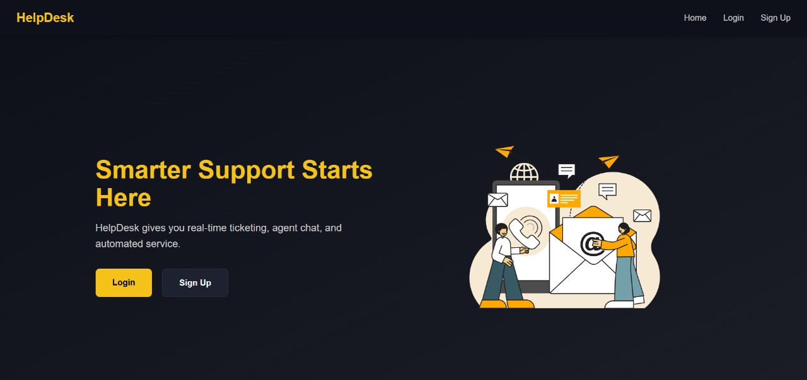
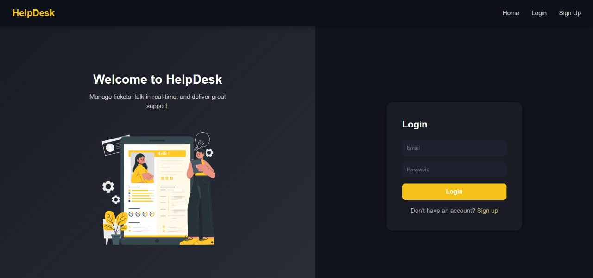
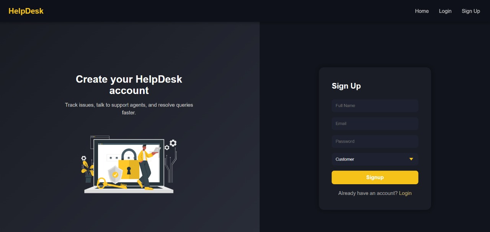
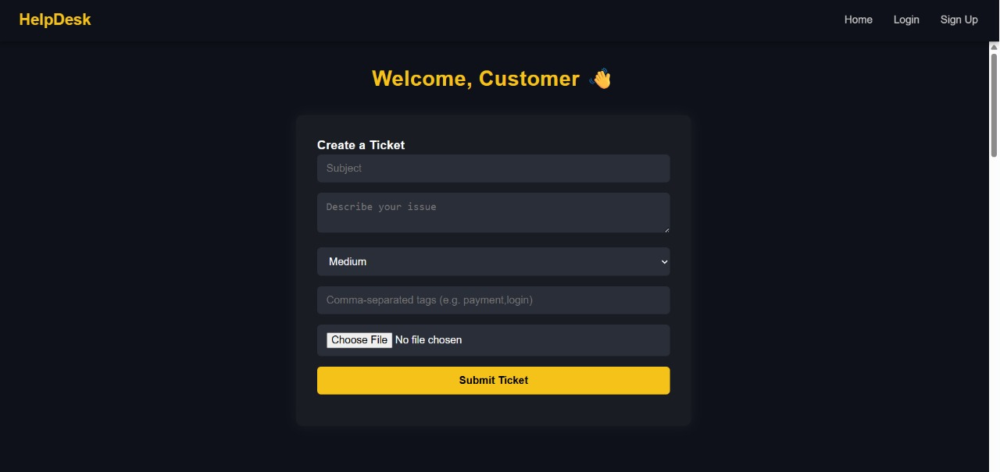
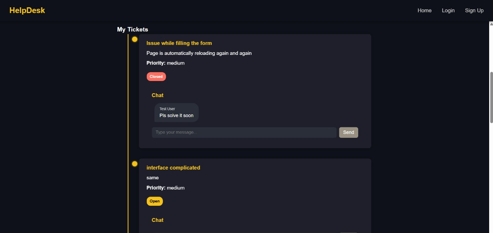
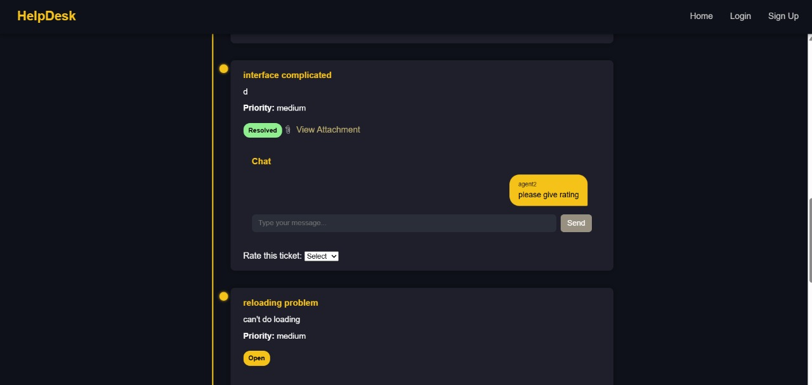
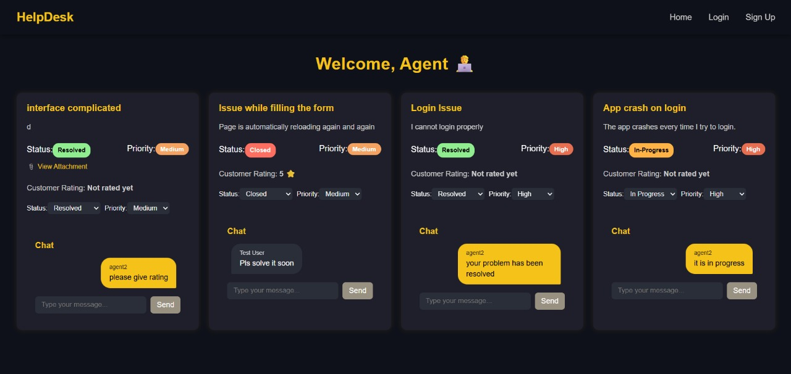
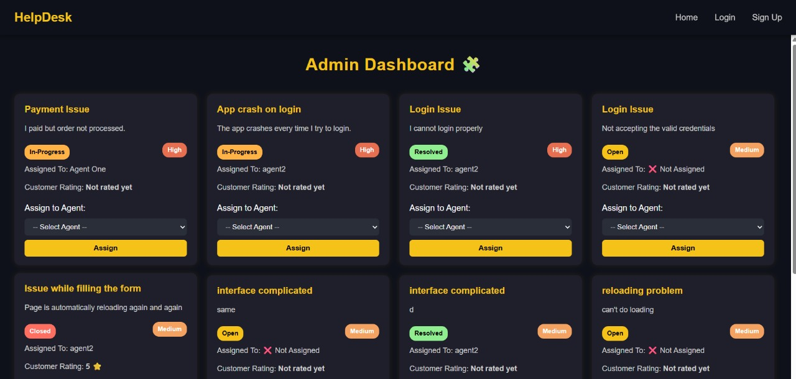

# 🛠️ HelpDesk (MERN + Socket.IO + Nodemailer + Multer)

A full-stack **Customer Support Ticketing System** built using the **MERN Stack** with **real-time chat**, **file uploads**, **role-based dashboards**, and **basic analytics** — simulating a real-world helpdesk experience.

> 💡 Designed for customers to raise tickets, agents to resolve them, and admins to manage the entire process seamlessly.

---

## 🚀 Features

### 🧑‍💼 User Roles
- 👤 **Customer** – Create tickets, chat with agents, give feedback.
- 🛠️ **Agent** – View assigned tickets, respond in real-time, update status/priority.
- 👑 **Admin** – View all tickets, assign agents, monitor performance and analytics.

### 💡 Functional Highlights

- 🎫 **Ticket Creation** with:
  - Dynamic **categories**
  - Priority selection: **High**, **Medium**, **Low**
- 💬 **Real-Time Chat** between customers and agents using **Socket.IO**
- 📎 **File Upload Support** via **Multer** (attachments per ticket)
- 📧 **Email Notifications** using **Nodemailer via Ethereal** (on ticket creation/assignment)
- ⭐ **Customer Feedback & Ratings** for resolved tickets
- 📊 **Admin Analytics** (Ticket status distribution, agent ratings, etc.)
- 🗂️ **Role-Based Dashboards** tailored for Customer, Agent, and Admin
- 📚 **Knowledge Base / FAQs**

---

## 🖥️ Tech Stack

| Tech        | Description              |
|-------------|--------------------------|
| **Frontend**  | React.js, CSS (custom, responsive) |
| **Backend**   | Node.js, Express.js     |
| **Database**  | MongoDB + Mongoose      |
| **Real-time** | Socket.IO               |
| **File Upload** | Multer               |
| **Email Service** | Nodemailer (for ticket notifications) |

---

## 📸 Screenshots

### 🏠 Home Page

### 🔐 Login Page

### 🔐SignUp Page

### 👤 Customer Dashboard

### 🛠️ Agent Dashboard

### 👑 Admin Dashboard

---

> **Empowering support teams to deliver faster, smarter, and better — one ticket at a time. 🎯**

